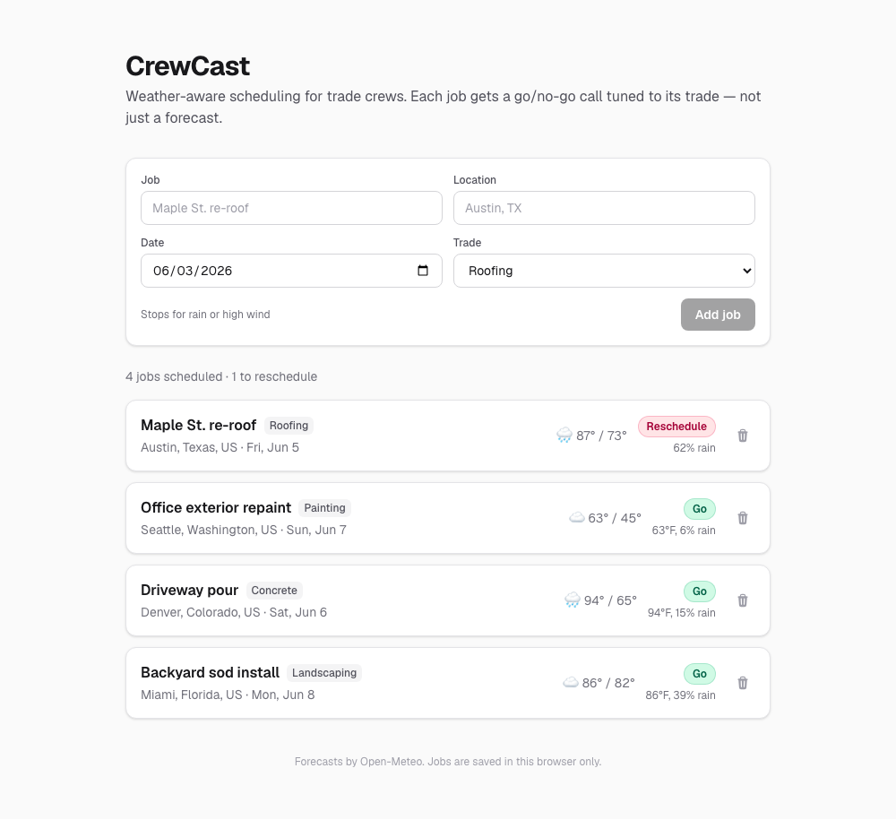

# CrewCast

**Weather-aware job scheduling for trade crews.** Enter your jobs — location, date, and trade — and each one gets a **Go / Caution / Reschedule** verdict tuned to that trade's tolerances. Not a forecast; a decision.

Day 03 of Savion's [100 Day AI Build Challenge](https://100dayaichallenge.com) — one app per day for 100 days.

**[Live demo →](https://weatherapp.100dayaichallenge.com)**



## Why this isn't a vanilla weather app

The forecast is a commodity — everyone sees the same numbers. The value is in what those numbers *mean for a specific decision*. CrewCast bakes in per-trade rules, so the **same forecast produces a different verdict depending on the trade**:

| Trade | Reschedules when | Cautions when |
|---|---|---|
| Roofing | ≥60% rain or wind >25 mph | 30–60% rain, or 15–25 mph wind |
| Painting | ≥50% rain or high <50°F (won't cure) | 20–50% rain, or high 50–60°F |
| Concrete | overnight <35°F (freeze) or >0.25" rain | overnight 35–40°F, or ≥40% rain |
| Landscaping | >0.5" rain or ≥70% rain | 40–70% rain |
| General | ≥60% rain, >100°F, or <32°F | 30–60% rain |

A 62%-rain day is a **Reschedule** for a roofing crew but only a **Caution** for landscapers. That distinction is the whole app.

## Stack

- **Next.js (App Router) + TypeScript + Tailwind v4**
- **[Open-Meteo](https://open-meteo.com/)** for geocoding + forecasts — free, no API key, called straight from the browser
- **No backend, no database.** Jobs persist in `localStorage`; the app deploys as near-static to Vercel

## Run locally

```bash
npm install
npm run dev      # http://localhost:3000
npm run build    # production build
```

## How it works

1. You add a job (location text, date, trade). It's saved to `localStorage`.
2. The location is geocoded to coordinates (cached on the job), then the daily forecast is fetched from Open-Meteo. Multiple jobs in one city share a single forecast call.
3. The job's date + trade run through the rule table in [`lib/trades.ts`](lib/trades.ts) to produce the verdict and a plain-English reason.
4. Jobs past Open-Meteo's ~16-day horizon show "too far out" instead of a fabricated verdict.

## Project layout

| Purpose | File |
|---|---|
| Per-trade rule table (the differentiator) | `lib/trades.ts` |
| Forecast → verdict scoring | `lib/verdict.ts` |
| Open-Meteo client (geocode + forecast) | `lib/weather.ts` |
| `localStorage`-backed job list | `lib/useJobs.ts` |
| Dashboard + per-job forecast resolution | `app/page.tsx` |

## Links

- **Live demo:** https://weatherapp.100dayaichallenge.com
- **Challenge tracker:** https://100dayaichallenge.com
